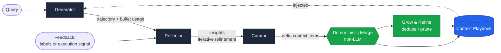
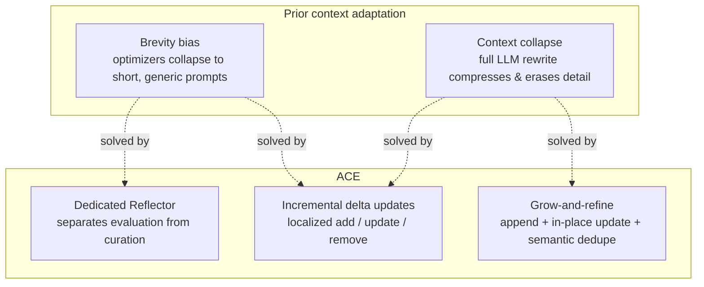
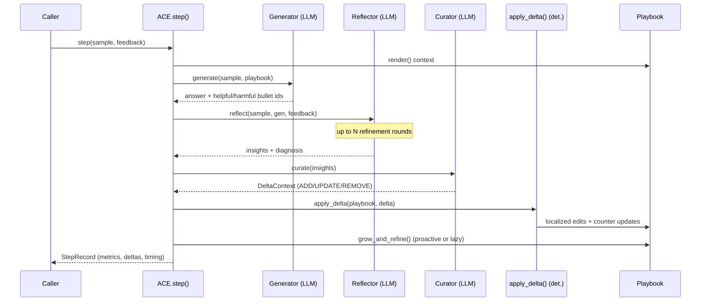
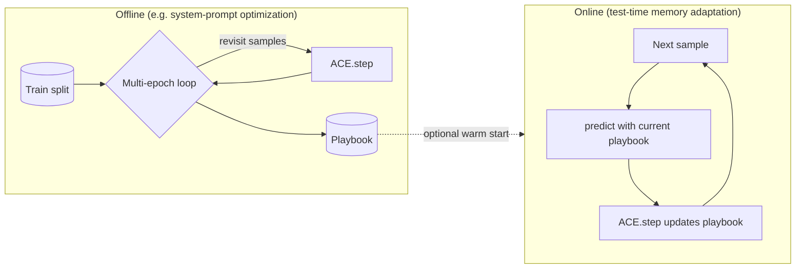
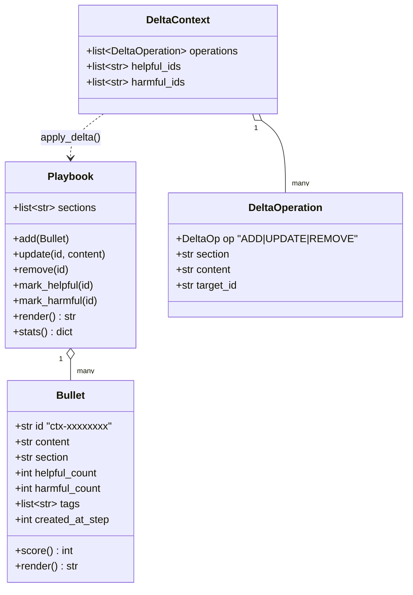
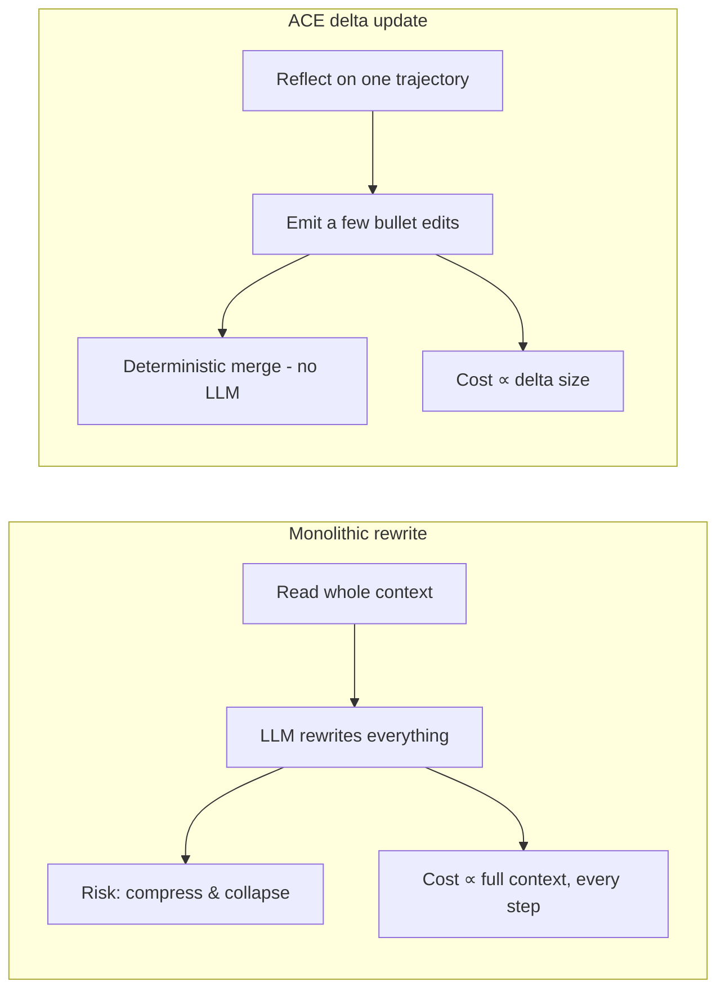

# ACE Architecture

This document explains how the **Agentic Context Engineering (ACE)** framework
is structured and how a run flows through it. It is the engineering companion to
the paper *"Agentic Context Engineering: Evolving Contexts for Self-Improving
Language Models"* (ICLR 2026).

> **TL;DR** — ACE treats an LLM's context as an evolving **playbook** of small,
> itemized **bullets**. A **Generator** solves a query, a **Reflector** distills
> reusable lessons, and a **Curator** emits **incremental delta operations** that
> are merged by deterministic (non-LLM) logic. A **grow-and-refine** step keeps
> the playbook compact. This avoids *brevity bias* and *context collapse*.

---

## 1. The big picture

The three **roles** are LLM-backed and specialized; the **merge** and
**grow-and-refine** steps are plain, auditable Python. That separation is the
heart of the design: the model only ever *proposes localized edits*, so
accumulated knowledge can never be silently erased by a runaway rewrite.

---

## 2. The two failure modes ACE fixes

`examples/02_context_collapse.py` reproduces context collapse with a
`MonolithicRewriteAgent` and shows ACE staying collapse-free.

---

## 3. The adaptation step (sequence)

---

## 4. Offline vs. online adaptation

- **Offline** (`ACE.adapt_offline`): multiple epochs over a training split to
  progressively strengthen the playbook. Optionally uses ground-truth labels.
- **Online** (`ACE.adapt_online`): for each test sample, predict first, then
  learn from the *same* trajectory and feedback. Can be warm-started from an
  offline playbook (the paper's strongest AppWorld configuration).

---

## 5. Data model

A **bullet** is the atomic unit (akin to a memory entry in Dynamic Cheatsheet /
A-MEM, plus counters). Bullets are grouped into **sections**
(`strategies`, `domain_concepts`, `common_mistakes`, `tool_usage`,
`formatting` by default). The Generator references bullet **ids** so updates are
*localized*.

---

## 6. Module map

| Module | Responsibility |
| --- | --- |
| `ace/playbook.py` | `Bullet`, `Playbook` — the evolving, sectioned context |
| `ace/delta.py` | `DeltaOperation`, `DeltaContext`, `apply_delta` — deterministic merge |
| `ace/roles.py` | `Generator`, `Reflector`, `Curator` + their prompts |
| `ace/refine.py` | `grow_and_refine` — semantic dedupe + harmful-bullet pruning |
| `ace/engine.py` | `ACE` orchestrator, `adapt_offline` / `adapt_online`, `StepRecord` |
| `ace/llm.py` | `LLM` protocol, `OpenAILLM`, deterministic `SimulatedLLM` |
| `ace/feedback.py` | `Feedback` — labeled or label-free execution signals |
| `ace/tasks.py` | `Sample`, `Task`, `TeachingEnvironment` (offline benchmark) |
| `ace/baselines.py` | `StaticAgent`, `MonolithicRewriteAgent` (context collapse) |
| `ace/visualize.py` | `LiveRunVisualizer` (terminal), `render_html_report` (HTML) |
| `ace/integrations/openai_agents.py` | `ACEAgent` — OpenAI Agents SDK memory |
| `ace/cli.py` | `ace` command-line entrypoint |

---

## 7. Why incremental deltas are cheap

Because the merge is non-LLM and operations are itemized:

- multiple deltas can be merged **in parallel** (batched adaptation);
- adaptation cost scales with the **delta**, not the whole context;
- long contexts amortize well at serve time via **KV-cache reuse**.

The paper reports up to **−86.9%** adaptation latency, **−75.1%** rollouts
(offline AppWorld vs GEPA), and **−83.6%** token cost (online FiNER vs Dynamic
Cheatsheet). `examples/03_offline_vs_online.py` illustrates the delta-vs-rewrite
token-ingestion gap on the bundled teaching environment.

---

## 8. Extending ACE

- **New backend** — implement the two-method `LLM` protocol (`complete`,
  `complete_json`) and pass it to `ACE(...)`.
- **New task** — build a `Task` with your own samples and an `evaluate` scorer,
  or wrap a live environment and feed `Feedback(signal=...)` for the label-free
  path.
- **New agent framework** — mirror `ace/integrations/openai_agents.py`: inject
  `playbook.render()` into the system prompt and call `ace.step(...)` with the
  captured trajectory.
- **Semantic dedupe** — pass `embedder=make_openai_embedder()` (or any batched
  embedding callable) to `ACE(...)` for embedding-based de-duplication.
