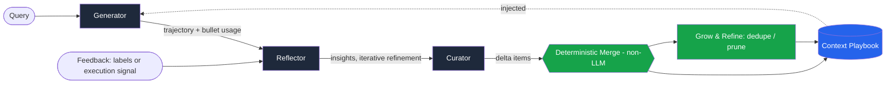
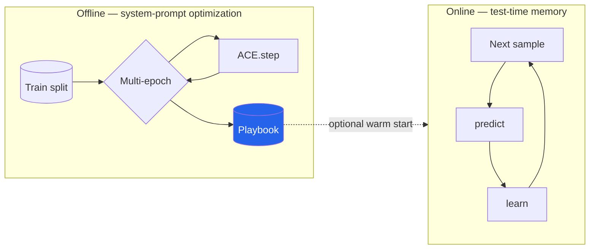

<div align="center">

# 🎮 ACE — Agentic Context Engineering

### Evolving, self-improving **context playbooks** for LLM agents — a clean, tested, framework-style implementation of the [ICLR 2026 paper](https://arxiv.org/abs/2510.04618), with first-class **OpenAI Agents SDK** support.

[](https://www.python.org/)
[](LICENSE)
[](tests/)
[](https://openai.github.io/openai-agents-python/)
[](https://rrahimi-uci.github.io/agentic-context-engineering/)
[](https://arxiv.org/abs/2510.04618)

**Stop re-prompting. Let your agent *write its own playbook* from experience.**

📖 **[Documentation site](https://rrahimi-uci.github.io/agentic-context-engineering/)** · 📐 **[Architecture](https://rrahimi-uci.github.io/agentic-context-engineering/architecture.html)**

[Quickstart](#-quickstart) · [Why ACE](#-why-ace) · [Cookbook](cookbook/README.md) · [Use on your own task](#-use-it-on-your-own-task) · [OpenAI Agents SDK](#-use-it-with-the-openai-agents-sdk) · [How it works](#-how-it-works) · [Results](#-results) · [Architecture](ARCHITECTURE.md)

</div>

---

## What is this?

LLM agents and domain experts increasingly improve through **context adaptation** —
editing the *inputs* (instructions, strategies, evidence) instead of the *weights*.
But the two dominant approaches break down:

- **Brevity bias** — prompt optimizers collapse toward short, generic instructions and throw away hard-won domain detail.
- **Context collapse** — letting an LLM *rewrite the whole context* every step compresses it into a lossy summary and **craters accuracy** (see below).

**ACE** fixes both. It treats context as an **evolving playbook** of small, itemized
**bullets** that *accumulate, refine, and organize* strategies over time, through a
modular **Generator → Reflector → Curator** loop with **incremental delta updates** and a
**grow-and-refine** mechanism. The result: comprehensive, scalable, self-improving context — with low overhead.

> This repository is a faithful, dependency-light, **fully tested** implementation you can
> use in a couple of commands and a few lines of code.

---

## ✨ Why ACE

| | Prompt optimizers (GEPA, MIPRO) | Monolithic memory (full rewrite) | **ACE** |
|---|---|---|---|
| Keeps domain detail | ❌ brevity bias | ⚠️ erodes over time | ✅ accumulates |
| Survives long horizons | ⚠️ | ❌ **context collapse** | ✅ incremental deltas |
| Update cost | 🐢 full re-optimization | 🐢 full re-ingest each step | ⚡ tiny deltas, non-LLM merge |
| Works without labels | ⚠️ | ✅ | ✅ execution feedback |
| Interpretable / editable | ⚠️ | ⚠️ | ✅ inspectable bullets |

---

## 🚀 Quickstart

```bash
git clone https://github.com/rrahimi-uci/agentic-context-engineering && cd agentic-context-engineering
pip install -e .            # core library (numpy + rich only)
```

Run the headline comparison — **no API key required** (uses a deterministic, offline teaching environment):

```bash
ace demo --html report.html
```

```
┏━━━━━━━━━━━━━━━━━━━━━━━━━━━━━┳━━━━━━━━━━┳━━━━━━━━━━┳━━━━━━━━━━━━━┓
┃ Method                      ┃ Accuracy ┃ Playbook ┃ Note        ┃
┡━━━━━━━━━━━━━━━━━━━━━━━━━━━━━╇━━━━━━━━━━╇━━━━━━━━━━╇━━━━━━━━━━━━━┩
│ Base LLM (no context)       │ 44.4%    │ 0        │ —           │
│ ACE (offline → eval)        │ 83.3%    │ 5        │ +38.9 pts   │
│ Monolithic rewrite (online) │ 72.2%    │ 4        │ 2 collapses │
│ ACE (online)                │ 83.3%    │ 6        │ no collapse │
└─────────────────────────────┴──────────┴──────────┴─────────────┘
```

Watch a run adapt **live in your terminal**:

```bash
ace run            # animated dashboard: playbook growth, accuracy, deltas
```

### …or in ~10 lines of Python

```python
from ace import ACE, SimulatedLLM, TeachingEnvironment, build_teaching_task
from ace.baselines import StaticAgent

env  = TeachingEnvironment()
task = build_teaching_task()
train, test = task.split()

base = StaticAgent(SimulatedLLM(env)).run(test)        # no learning
ace  = ACE(SimulatedLLM(env))
ace.adapt_offline(train)                               # build a playbook from feedback
result = ace.evaluate(test)                            # measure on held-out data

print(f"Base {base.accuracy:.0f}%  →  ACE {result.accuracy:.0f}%")
print(ace.playbook.render())                           # human-readable playbook
```

---

## 🔌 Use it with the OpenAI Agents SDK

ACE plugs into the [OpenAI Agents SDK](https://openai.github.io/openai-agents-python/)
as a **self-improving memory**. The playbook is injected into your agent's
instructions on every run; after each task you hand back feedback (a label *or*
just natural execution signal) and ACE grows the playbook.

```bash
pip install "ace-playbook[all]"     # adds openai + openai-agents (SDK needs Python 3.10+)
export OPENAI_API_KEY=sk-...
```

One call wraps your agent so it learns — `wrap_agent` builds the ACE engine,
loads a saved playbook if present, and persists what it learns:

```python
from agents import Agent
from ace import wrap_agent                # one top-level import

agent = wrap_agent(
    Agent(name="Support", instructions="You are a concise support agent."),
    model="gpt-4o-mini",
    playbook="support_memory.json",       # load if it exists; save target for .save()
)

# Run + learn from execution feedback — no ground-truth labels needed:
out = agent.run_and_learn(
    "Cancel order #C99",
    signal="Policy: cancellation requires identity verification first.",
)
print(out.output)
print(agent.playbook.render())            # the agent just wrote itself a rule
agent.save()                              # learned memory survives a restart
```

You don't have to think about the internals — but they're all there:

- **Auto-learn from tool errors** — a `RunHooks` listener records each run; if a
  tool fails and you pass no explicit feedback, that error becomes the signal.
- **Rich trajectories** — tool calls/outputs/messages are captured via the SDK's
  typed run-items, so the Reflector learns from *what actually happened*.
- **Tracing** — the learning step is emitted as an `ace.learn` span next to the
  agent run in the OpenAI trace UI.
- **Async (non-blocking)** — inside an event loop (FastAPI, notebooks), use the
  async entry points: `await agent.arun_and_learn("Cancel #C99", signal="...")`.
  The blocking Reflector/Curator calls run off the event loop, so your server
  stays responsive.
- **Streaming** — `await agent.arun_streamed_and_learn(query, on_event=...)`,
  or `agent.stream(query)` for full control over `stream_events()`.
- **Cost is observable** — `RunResult.summary()` and every `StepRecord` report
  `llm_calls`, prompt/completion tokens, and `cached_prompt_tokens` (OpenAI's
  automatic prefix cache of the static system + playbook prefix).
- **Sessions are orthogonal** — ACE memory is *cross-task learned strategy*;
  the SDK's `session=` is *within-conversation history*. Pass a session straight
  through any run: `agent.run_and_learn(q, session=my_session, signal=...)`.

Need to share one engine across agents, use a non-OpenAI backend, or pass dynamic
(callable) base instructions? Drop down to `ACEAgent(base, ace=...)` directly —
`wrap_agent` is just the batteries-included wrapper around it. A runnable
end-to-end example lives in `examples/04_openai_agents.py`.

---

## 🧩 Use it on *your own* task

Two extension points make ACE general-purpose — bring your own `Task` and your
own feedback (no ground-truth labels required):

```python
from ace import ACE, Feedback, Sample, Task, OpenAILLM

my_task = Task(name="my-domain", samples=[Sample(id="1", question="...")],
               evaluate=lambda pred, s: my_score(pred, s))

def my_feedback(sample, generation) -> Feedback:
    # plug in execution signals, a reward fn, or an LLM judge — your call
    ok = run_my_checks(generation.answer)
    return Feedback(correct=ok, signal="tests passed" if ok else "tests FAILED")

ace = ACE(OpenAILLM(model="gpt-4o-mini"))
ace.adapt_online(my_task, feedback_fn=my_feedback)   # learns from YOUR signals
```

See `examples/05_custom_task.py` (runs offline). The Curator calls the LLM to
propose `ADD`/`UPDATE`/`REMOVE` edits by default (deterministic fallback never
drops a lesson); force deterministic curation with `ACEConfig(curator_use_llm=False)`.

---

## 🧠 How it works



1. **Generator** solves the query using the current playbook, flagging which bullets helped or misled.
2. **Reflector** critiques the trajectory against feedback and distills concrete, reusable **insights** (optionally over several refinement rounds).
3. **Curator** turns insights into a few **delta operations** (`ADD` / `UPDATE` / `REMOVE`).
4. **Deterministic merge** applies those edits to the playbook — *no LLM, no rewrite, no collapse.*
5. **Grow-and-refine** de-duplicates (semantic or lexical) and prunes consistently harmful bullets.

ACE runs in two regimes — multi-epoch **offline** optimization and sequential **online** test-time adaptation (which can be warm-started from an offline playbook):



Full diagrams (roles, bullet lifecycle, grow-and-refine, feedback regimes, data model — 14 in total) live in **[ARCHITECTURE.md](ARCHITECTURE.md)** and on the **[docs site](https://rrahimi-uci.github.io/agentic-context-engineering/architecture.html)**.

---

## 📊 Results

### Reproducible, in this repo (offline teaching environment, no API key)

These come straight from the bundled examples (`examples/*.py`) and are fully deterministic:

| Demo | Base LLM | ACE | Δ |
|---|---|---|---|
| Quickstart (offline → held-out eval) | 44.4% | **83.3%** | **+38.9 pts** |
| Context-collapse benchmark (online) | 41.7% | **88.3%** | **+46.6 pts** |
| Offline warmup + online | 34.5% | **96.6%** | **+62.1 pts** |

In the context-collapse demo, the **monolithic-rewrite** baseline collapses its context
7× and stalls at 60.0%, while ACE never collapses. Adaptation **token ingestion** for ACE
is **−94.9%** vs. full re-ingestion (deltas are tiny). Generate the visual report with
`ace demo --html report.html` → [sample report](docs/assets/sample_report.html).

### Reported in the paper (real benchmarks, DeepSeek-V3.1)

| Benchmark | Baseline | **+ ACE** |
|---|---|---|
| AppWorld (agent, avg) | 42.4% (ReAct) | **59.5%** (+17.1) |
| FiNER (financial NER) | 70.7% | **78.3%** |
| Formula (financial reasoning) | 67.5% | **85.5%** |
| Adaptation latency (offline AppWorld) | — | **−86.9%** |
| Token cost (online FiNER) | — | **−83.6%** |

> On the AppWorld leaderboard, ReAct+ACE with an open-source model **matches the
> top-ranked production GPT-4.1 agent** and surpasses it on the harder
> test-challenge split. (Numbers above are from the paper; this repo reproduces
> the *mechanism* and its qualitative behavior offline.)

---

## 🗂️ What's in the box

```
ace/
├── playbook.py      # Bullet + Playbook: the evolving, sectioned context
├── delta.py         # incremental ADD/UPDATE/REMOVE + deterministic merge
├── roles.py         # Generator · Reflector · Curator (+ prompts)
├── refine.py        # grow-and-refine: semantic dedupe + harmful pruning
├── engine.py        # ACE orchestrator: offline / online adaptation
├── llm.py           # LLM protocol · OpenAILLM · deterministic SimulatedLLM
├── feedback.py      # labeled or label-free execution feedback
├── tasks.py         # Sample/Task + offline TeachingEnvironment
├── baselines.py     # StaticAgent + MonolithicRewriteAgent (context collapse)
├── visualize.py     # live terminal dashboard + self-contained HTML report
├── integrations/
│   └── openai_agents.py   # wrap_agent / ACEAgent: drop-in self-improving memory
└── cli.py           # `ace demo | run | playbook | version`
cookbook/            # 10 guided recipes (7 need no API key) + tests
examples/            # 5 runnable demos (4 need no API key)
tests/               # 161 tests, run in <1s, zero network
```

---

## 🧪 Develop & test

```bash
pip install -e ".[dev]"
pytest                       # 161 tests, fully offline, ~1s
python examples/01_quickstart.py
python examples/02_context_collapse.py   # writes ace_report.html
```

The full quality gate (run in CI, and locally before a PR):

```bash
ruff check ace tests cookbook examples       # lint
ruff format --check ace tests cookbook examples
mypy ace                                      # type-check (backs py.typed)
pytest --cov=ace --cov-fail-under=90          # tests + coverage floor (currently ~95%)
```

The bundled `SimulatedLLM` + `TeachingEnvironment` make every demo and test
**deterministic and key-free**, so the ACE *control loop* is exercised end-to-end
in CI. Swap in `OpenAILLM` for real models and benchmarks — the algorithm and
prompts are unchanged.

Release notes live in **[CHANGELOG.md](CHANGELOG.md)**.

---

## 🔍 Key concepts (glossary)

- **Playbook** — the evolving context, a set of itemized **bullets** grouped into sections.
- **Bullet** — one atomic lesson with a stable id and `helpful`/`harmful` counters.
- **Delta update** — a small, localized batch of `ADD`/`UPDATE`/`REMOVE` edits (vs. a full rewrite).
- **Grow-and-refine** — append new bullets, update existing in place, semantically de-duplicate, prune harmful.
- **Generator / Reflector / Curator** — the three specialized roles of the ACE loop.
- **Offline vs. online** — multi-epoch optimization on a train split vs. sequential test-time adaptation.

---

## 📚 Citation

```bibtex
@inproceedings{zhang2026ace,
  title     = {Agentic Context Engineering: Evolving Contexts for Self-Improving Language Models},
  author    = {Zhang, Qizheng and Hu, Changran and Upasani, Shubhangi and others},
  booktitle = {International Conference on Learning Representations (ICLR)},
  year      = {2026},
  url       = {https://arxiv.org/abs/2510.04618}
}
```

This implementation is an independent, open-source reproduction for research and
educational use. All credit for the ACE method belongs to the original authors.

## 📝 License

[MIT](LICENSE). Contributions welcome — see [CONTRIBUTING.md](CONTRIBUTING.md).

<div align="center">
<sub>Built to make <b>self-improving LLM agents</b> easy: <code>pip install</code> → a few lines → a playbook that gets better with every task.</sub>
</div>
