# ACE Architecture

This document explains how the **Agentic Context Engineering (ACE)** framework
is structured and how a run flows through it. It is the engineering companion to
the paper *"Agentic Context Engineering: Evolving Contexts for Self-Improving
Language Models"* (ICLR 2026).

> **TL;DR** — ACE treats an LLM's context as an evolving **playbook** of small,
> itemized **bullets**. A **Generator** solves a query, a **Reflector** distills
> reusable lessons, and a **Curator** emits **incremental delta operations** that
> are merged by deterministic (non-LLM) logic. A **grow-and-refine** step keeps
> the playbook compact. This avoids *brevity bias* and *context collapse*.

## Contents

1. [The big picture](#1-the-big-picture)
2. [The two failure modes ACE fixes](#2-the-two-failure-modes-ace-fixes)
3. [The adaptation step (sequence)](#3-the-adaptation-step-sequence)
4. [Offline vs. online adaptation](#4-offline-vs-online-adaptation)
5. [Data model](#5-data-model)
6. [Module map](#6-module-map)
7. [Why incremental deltas are cheap](#7-why-incremental-deltas-are-cheap)
8. [Extending ACE](#8-extending-ace)
9. [The three roles in depth](#9-the-three-roles-in-depth)
10. [A bullet's lifecycle](#10-a-bullets-lifecycle)
11. [Grow-and-refine algorithm](#11-grow-and-refine-algorithm)
12. [Feedback regimes (labeled vs. label-free)](#12-feedback-regimes-labeled-vs-label-free)
13. [OpenAI Agents SDK integration](#13-openai-agents-sdk-integration)
14. [End-to-end runtime data flow](#14-end-to-end-runtime-data-flow)
15. [Design decisions & FAQ](#15-design-decisions--faq)
16. [Comparison with prior methods](#16-comparison-with-prior-methods)
17. [Glossary & references](#17-glossary--references)

---

## 1. The big picture

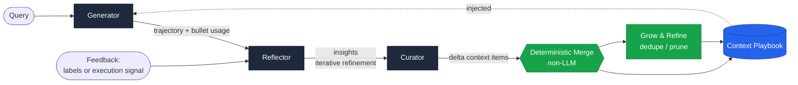

The three **roles** are LLM-backed and specialized; the **merge** and
**grow-and-refine** steps are plain, auditable Python. That separation is the
heart of the design: the model only ever *proposes localized edits*, so
accumulated knowledge can never be silently erased by a runaway rewrite.

---

## 2. The two failure modes ACE fixes

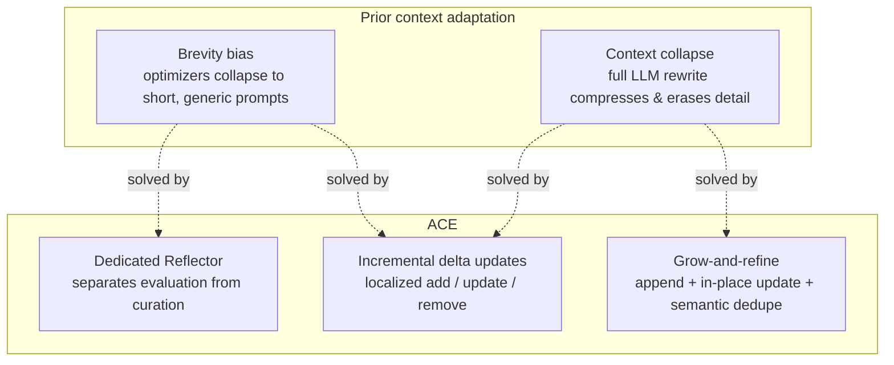

`examples/02_context_collapse.py` reproduces context collapse with a
`MonolithicRewriteAgent` and shows ACE staying collapse-free.

---

## 3. The adaptation step (sequence)

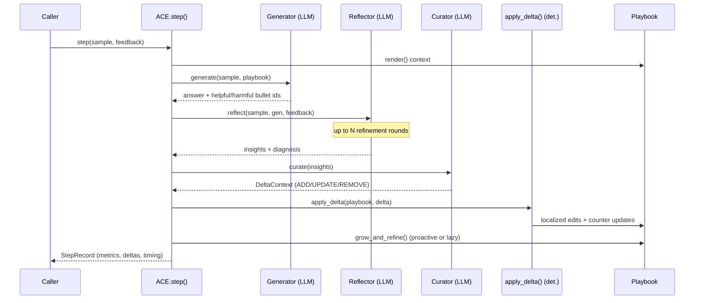

---

## 4. Offline vs. online adaptation

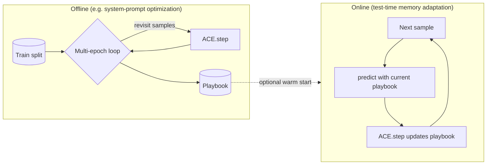

- **Offline** (`ACE.adapt_offline`): multiple epochs over a training split to
  progressively strengthen the playbook. Optionally uses ground-truth labels.
- **Online** (`ACE.adapt_online`): for each test sample, predict first, then
  learn from the *same* trajectory and feedback. Can be warm-started from an
  offline playbook (the paper's strongest AppWorld configuration).

---

## 5. Data model

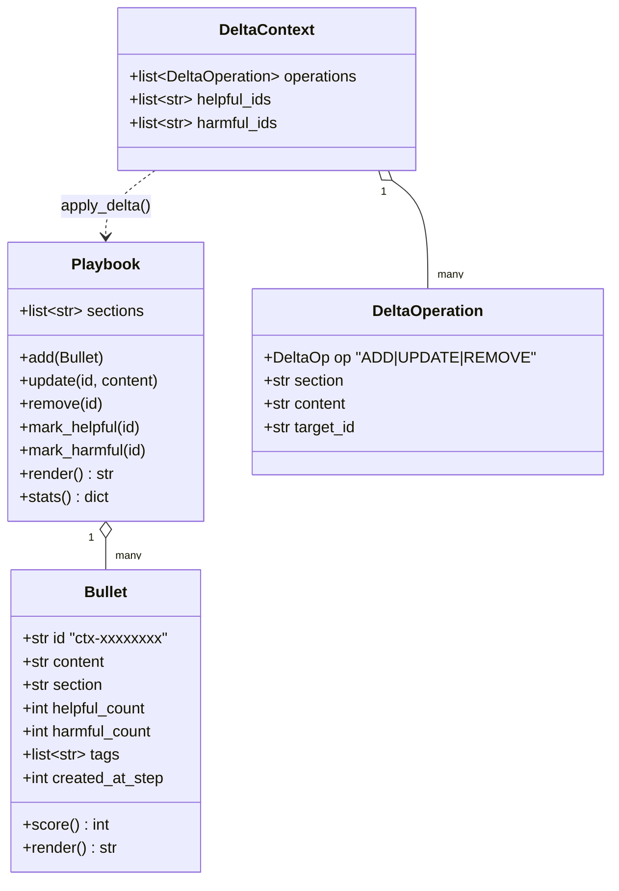

A **bullet** is the atomic unit (akin to a memory entry in Dynamic Cheatsheet /
A-MEM, plus counters). Bullets are grouped into **sections**
(`strategies`, `domain_concepts`, `common_mistakes`, `tool_usage`,
`formatting` by default). The Generator references bullet **ids** so updates are
*localized*.

---

## 6. Module map

| Module | Responsibility |
| --- | --- |
| `ace/playbook.py` | `Bullet`, `Playbook` — the evolving, sectioned context |
| `ace/delta.py` | `DeltaOperation`, `DeltaContext`, `apply_delta` — deterministic merge |
| `ace/roles.py` | `Generator`, `Reflector`, `Curator` + their prompts |
| `ace/refine.py` | `grow_and_refine` — semantic dedupe + harmful-bullet pruning |
| `ace/engine.py` | `ACE` orchestrator, `adapt_offline` / `adapt_online`, `StepRecord` |
| `ace/llm.py` | `LLM` protocol, `OpenAILLM`, deterministic `SimulatedLLM` |
| `ace/feedback.py` | `Feedback` — labeled or label-free execution signals |
| `ace/tasks.py` | `Sample`, `Task`, `TeachingEnvironment` (offline benchmark) |
| `ace/baselines.py` | `StaticAgent`, `MonolithicRewriteAgent` (context collapse) |
| `ace/visualize.py` | `LiveRunVisualizer` (terminal), `render_html_report` (HTML) |
| `ace/integrations/openai_agents.py` | `ACEAgent` — OpenAI Agents SDK memory |
| `ace/cli.py` | `ace` command-line entrypoint |

---

## 7. Why incremental deltas are cheap

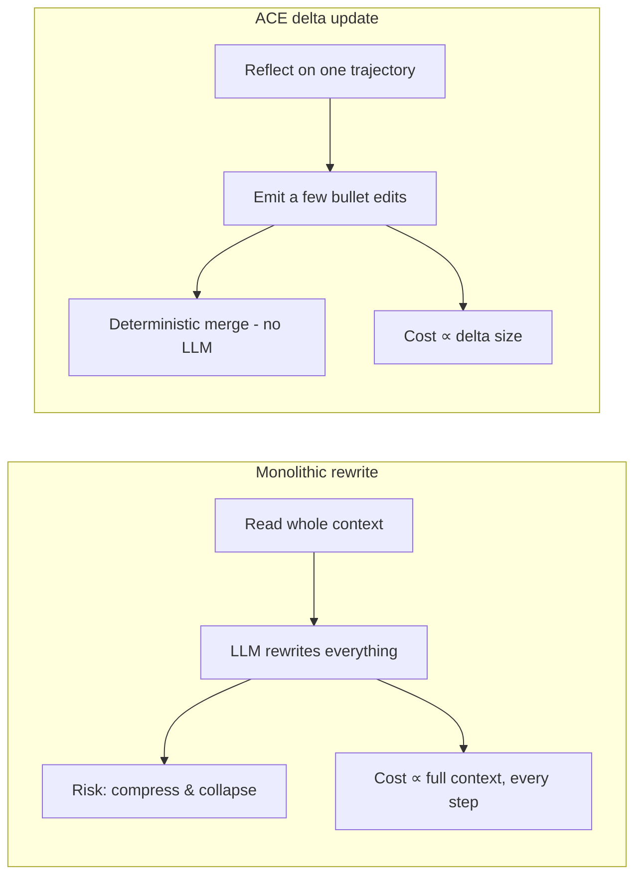

Because the merge is non-LLM and operations are itemized:

- multiple deltas can be merged **in parallel** (batched adaptation);
- adaptation cost scales with the **delta**, not the whole context;
- long contexts amortize well at serve time via **KV-cache reuse**.

The paper reports up to **−86.9%** adaptation latency, **−75.1%** rollouts
(offline AppWorld vs GEPA), and **−83.6%** token cost (online FiNER vs Dynamic
Cheatsheet). `examples/03_offline_vs_online.py` illustrates the delta-vs-rewrite
token-ingestion gap on the bundled teaching environment.

---

## 8. Extending ACE

- **New backend** — implement the two-method `LLM` protocol (`complete`,
  `complete_json`) and pass it to `ACE(...)`.
- **New task** — build a `Task` with your own samples and an `evaluate` scorer.
- **Custom / label-free feedback** — pass `feedback_fn(sample, generation) ->
  Feedback` to `adapt_offline` / `adapt_online`. This is the general extension
  point for real problems: return your own execution signals (test pass/fail,
  API errors, a reward function, an LLM-as-judge) instead of relying on
  ground-truth labels. See `examples/05_custom_task.py`.
- **Curation mode** — by default the Curator calls the LLM (`CURATOR_SYSTEM`)
  to propose `ADD`/`UPDATE`/`REMOVE` edits, with a deterministic ADD-only
  fallback that never drops a distilled lesson. Set
  `ACEConfig(curator_use_llm=False)` to force the deterministic path.
- **New agent framework** — mirror `ace/integrations/openai_agents.py`: inject
  `playbook.render()` into the system prompt and call `ace.step(...)` with the
  captured trajectory.
- **Semantic dedupe** — pass `embedder=make_openai_embedder()` (or any batched
  embedding callable) to `ACE(...)` for embedding-based de-duplication.

---

## 9. The three roles in depth

ACE's central design choice is a **division of labor**. One model doing
everything (solve + judge + rewrite) is the recipe for context collapse. ACE
splits the work so each role has a narrow, well-posed job.

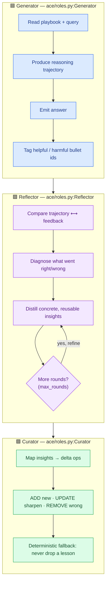

| Role | Input | Output | LLM? | Key property |
|---|---|---|---|---|
| **Generator** | playbook + query | trajectory, answer, bullet usage | ✅ | references bullets by **id** → enables localized updates |
| **Reflector** | trajectory + feedback | diagnosis + reusable **insights** | ✅ | separates *evaluation* from *curation*; iterative refinement |
| **Curator** | insights + playbook | **delta operations** | ✅ (det. fallback) | proposes *small* edits; never a full rewrite |
| **Merge** | delta + playbook | updated playbook | ❌ | deterministic, auditable, parallel-safe |

> The same model can power all three roles (the paper's fair-comparison setup),
> or you can mix backends via `ACE(generator_llm=..., reflector_llm=..., curator_llm=...)`.

---

## 10. A bullet's lifecycle

Each **bullet** is a tiny, addressable unit of knowledge with its own state.
Tracking that state is what lets ACE *grow* without bloating.

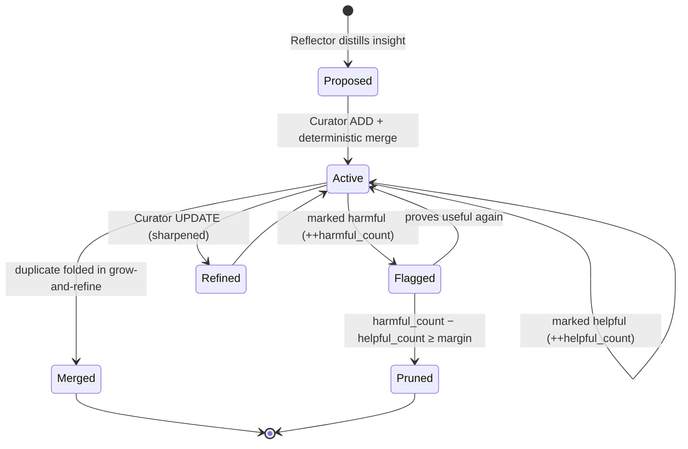

- **helpful/harmful counters** accumulate from Generator usage feedback.
- **dedupe** folds a near-duplicate's counters into the survivor (no signal lost).
- **prune** removes only *consistently* harmful bullets (configurable margin).

---

## 11. Grow-and-refine algorithm

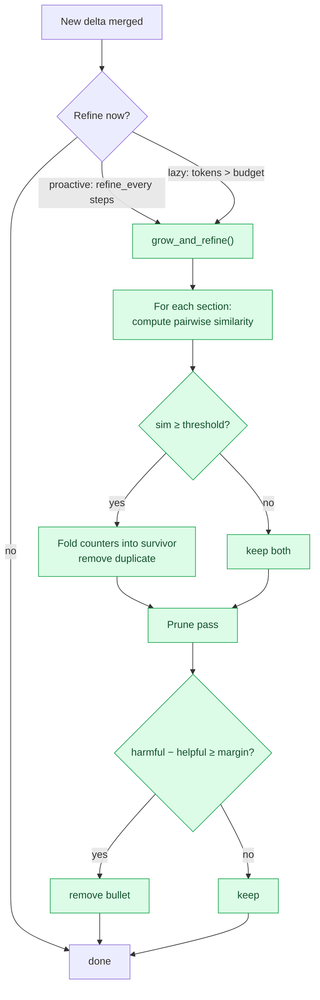

**Similarity backends** (`ace/refine.py`):

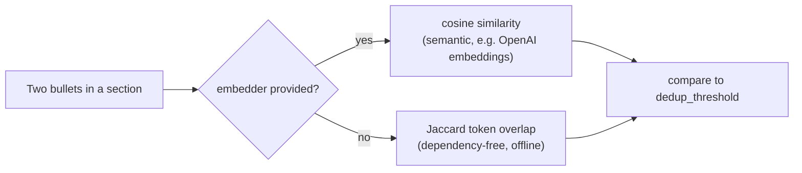

This is why the framework works fully offline (lexical fallback) yet scales to
semantic de-duplication when you pass `embedder=make_openai_embedder()`.

---

## 12. Feedback regimes (labeled vs. label-free)

ACE adapts with **or without** ground-truth labels — the label-free path is what
makes it work for live agents (the paper's headline AppWorld result).

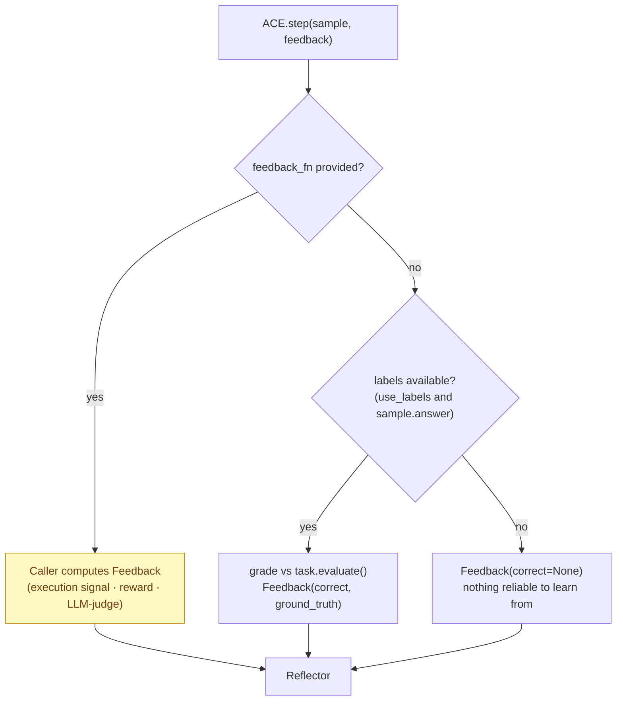

| Regime | How to use it | Example |
|---|---|---|
| **Labeled** | provide `sample.answer`; `use_labels=True` (default) | offline system-prompt optimization on a train split |
| **Custom hook** | pass `feedback_fn(sample, generation) → Feedback` | code tests pass/fail, API status, a reward model |
| **Pure label-free** | `signal=...` via the hook, no `ground_truth` | live agent learning from environment responses |

> The paper notes ACE is robust under rich feedback but can degrade without
> reliable signals — so the quality of `feedback_fn` matters.

---

## 13. OpenAI Agents SDK integration

`ACEAgent` (`ace/integrations/openai_agents.py`) makes ACE a **drop-in
self-improving memory** for any `agents.Agent`.

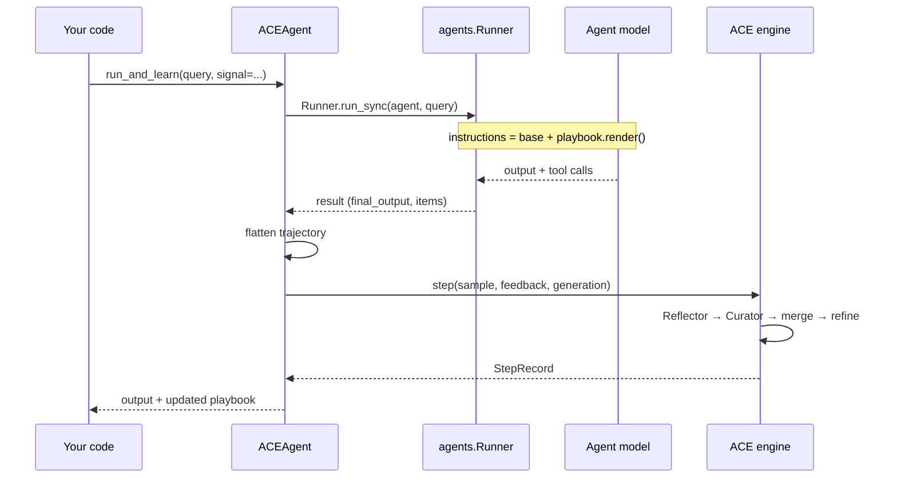

The playbook is injected via **dynamic instructions**, so each run automatically
sees the latest accumulated knowledge — no manual prompt plumbing.

---

## 14. End-to-end runtime data flow

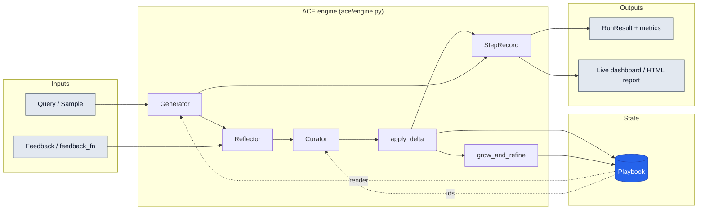

Every step produces a `StepRecord` (prediction, correctness, delta, merge,
refine, playbook size/tokens, latency) — the substrate for the live terminal
dashboard and the self-contained HTML report (`ace/visualize.py`).

---

## 15. Design decisions & FAQ

**Why itemized bullets instead of a single prompt?**
Localization. The Generator references bullet **ids**, so the Curator edits only
the relevant ones. Full-prompt rewriting is exactly what triggers context
collapse.

**Why is the merge deterministic (non-LLM)?**
Safety and cost. A mechanical merge can never accidentally summarize the whole
context into oblivion, multiple deltas can merge in parallel, and adaptation
cost scales with the *delta* size, not the full context.

**Why a separate Reflector?**
Separating *evaluation/insight-extraction* from *curation* improves context
quality (paper §4.6 ablation). One model judging and rewriting in a single pass
is where detail gets lost.

**Does a longer playbook mean higher serving cost?**
Not linearly. The paper reports **91.8%** of input tokens served from KV cache
during evaluation, cutting billed input cost **~82.6%** vs. counting raw tokens.

**When is ACE *not* worth it?**
Tasks solvable by a short, fixed instruction (e.g. HotPotQA-style retrieve-and-
synthesize, or fixed-strategy games). ACE shines when success needs detailed
domain knowledge, complex tool use, or environment-specific strategies.

**How do I cap playbook growth?**
Grow-and-refine de-dupes per concept; tune `dedup_threshold`, `harmful_margin`,
and choose proactive (`refine_every`) vs. lazy (`lazy_refine_token_budget`).

---

## 16. Comparison with prior methods

```mermaid
flowchart TB
    subgraph ICL["ICL / few-shot"]
        i1["fixed demonstrations"] --> i2["no accumulation"]
    end
    subgraph OPT["Prompt optimizers (GEPA, MIPRO)"]
        o1["search over instructions"] --> o2["brevity bias · costly rollouts"]
    end
    subgraph MEM["Monolithic memory (Dynamic Cheatsheet)"]
        m1["LLM rewrites whole memory"] --> m2["context collapse risk"]
    end
    subgraph ACE["ACE"]
        a1["itemized bullets"] --> a2["incremental deltas + grow-and-refine"]
        a2 --> a3["accumulates detail · low cost · no collapse"]
    end
```

| Property | ICL | GEPA / MIPRO | Dynamic Cheatsheet | **ACE** |
|---|---|---|---|---|
| Accumulates domain detail | ❌ | ❌ (brevity bias) | ⚠️ | ✅ |
| Avoids context collapse | n/a | n/a | ❌ | ✅ |
| Update cost | low | 🐢 high | 🐢 full rewrite | ⚡ delta |
| Label-free adaptation | ❌ | ⚠️ | ✅ | ✅ |
| Interpretable / editable | ⚠️ | ⚠️ | ⚠️ | ✅ ids + counters |

---

## 17. Glossary & references

**Glossary**

- **Context adaptation** — improving a model by editing its inputs, not weights.
- **Playbook** — ACE's evolving context: sectioned, itemized bullets.
- **Bullet** — one atomic lesson (id + content + helpful/harmful counters).
- **Delta** — a small batch of `ADD`/`UPDATE`/`REMOVE` ops over bullets.
- **Grow-and-refine** — append + in-place update + semantic dedupe + prune.
- **Brevity bias** — optimizers collapsing toward short, generic prompts.
- **Context collapse** — full LLM rewrite compressing/erasing accumulated detail.
- **Offline / online** — multi-epoch train-split optimization vs. sequential
  test-time adaptation.

**References**

- Zhang, Hu, et al. *Agentic Context Engineering: Evolving Contexts for
  Self-Improving Language Models.* ICLR 2026. [arXiv:2510.04618](https://arxiv.org/abs/2510.04618)
- Suzgun et al. *Dynamic Cheatsheet* (2025) — agentic external memory.
- Agrawal et al. *GEPA: Reflective Prompt Evolution* (2025).
- Shinn et al. *Reflexion* (2023) — reflection on failures.

> This repository is an independent, open-source implementation for research and
> educational use. All credit for the ACE method belongs to the original authors.
